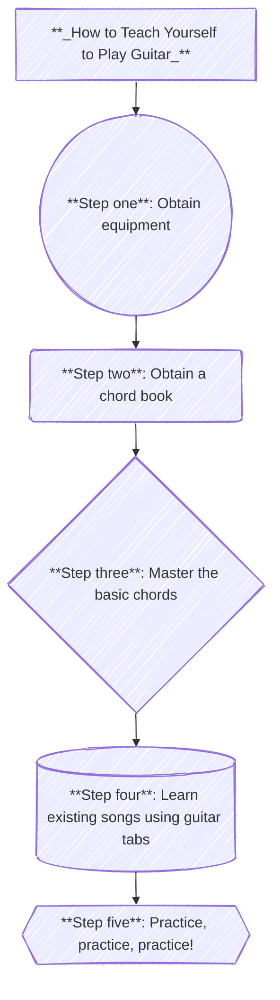

# How to Teach Yourself to Play Guitar

## Summary
**Step one**-
*Obtain equipment*: This is the **most important** step. Obtain a guitar.
  * Can be acoustic or electric, whichever you prefer.
  * Does **not** have to be expensive- most guitar stores sell bundles that include a guitar and an amplifier for a reasonable price.
  * Make sure to get **accessories** such as **guitar picks** and a **guitar tuner**.

**Step two**-
*Obtain a chord book*: This is where the journey begins! Obtain a guitar chord book at your nearest music store.
  * This book should be **detailed** and should also include lessons on **how** to play the chords, **not** just a list of the guitar chords.

**Step three**-
*Master the basic chords*: This is **very** important! Mastering the basic guitar chords is the foundation and backbone of learning guitar.
  * **Don't** rush- Learning guitar is a journey, not a sprint! Take your time and aim to learn 3 chords a week.
  * Set aside **30 minutes** to an **hour** each day to practice. It will pay off!
  * Remember that **most songs** use only **three** to **five** chords, so remember not to overthink it!

**Step four**-
*Learn existing songs using guitar tabs*: **Guitar tablature** is a very helpful resource for learning songs on the guitar. This will help you advance your guitar playing tremendously.
  * Start with **simple**, **three** to **five** chord songs.
  * Aim to learn **one song** per week.
  * [There are websites that provide **free** guitar tablature, such as **Ultimate Guitar**](https://www.ultimate-guitar.com/).

**Step five**-
*Practice, practice, practice!*: As the old saying goes, **_practice makes perfect_**! Practicing daily will help you develop your picking and fretting hand strength, as well as your muscle memory.
  * Remember that **no one** learns guitar in a day! Learning to play the guitar is a journey, and will take some time. However, it will be worth it!
  * Remember to take **regular breaks**! Playing too much without proper rest breaks will increase the chance of **hand and finger injuries**.
  * **Don't give up**! Don't quit before the **eureka** moment happens! Before you know it, you will be playing your favorite songs!
  
